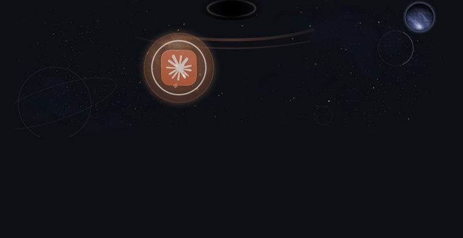
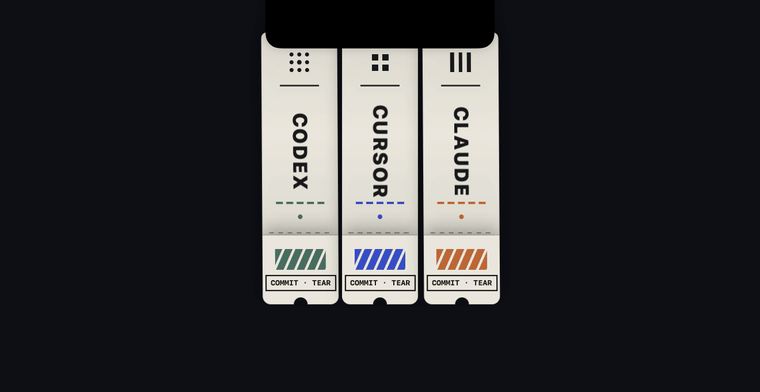

# NotchDial

Turn your MacBook notch into a playful switcher for your AI coding agents.

Hover the notch, and switch between **Codex / Cursor / Claude** in one of three hand-crafted modes — a pocket universe, a neon sign, or a strip of tear-off tickets.

| Orbit · Black Hole | Tear Tickets |
| --- | --- |
|  |  |

## Modes

- **Orbit · Black Hole** — a transparent deep-space scene composited straight onto your desktop: lensed starfield, twin nebulae, faint planet silhouettes, an accretion disk in the selected app's brand color. Swipe once and the next app flies in from deep space as a textured planet, bursts apart mid-flight and reassembles as its icon.
- **Neon Sign** — the current agent as a hand-bent neon sign: power-down flicker, letter-by-letter ignition, electric surge on launch.
- **Tear Tickets** — three paper tickets feed out of the notch and sway on real pendulum physics (roots pinned in the slot). Click one to tear its stub along the perforation — commit after tear.

## Install

Requirements: macOS 13+, a notched MacBook (Apple Silicon), Xcode Command Line Tools.

```bash
./build.sh
cp -R build/NotchDial.app /Applications/
open /Applications/NotchDial.app
```

## Usage

- Hover the notch to expand; move away to collapse.
- Orbit / Neon: one swipe = one step (momentum is ignored by design); click the centered item to activate the app, Dock-style.
- Tickets: just click a ticket.
- Menu bar capsule icon: switch modes (⌘1/⌘2/⌘3), pause hover trigger, launch at login, quit.

## Configure your apps

Targets currently live in `Sources/Targets.swift` (name / bundle path / brand tint / planet palette). A config file is planned for v1.1.

## Debug flags

`--pin` keep expanded · `--snap out.png` offscreen snapshot · `--film dir/` frame-by-frame capture · `--selftest` gesture engine tests · `--clicktest` synthesized-click hit-testing test · `--launchtest` measures click→app-activation latency

## License

MIT
